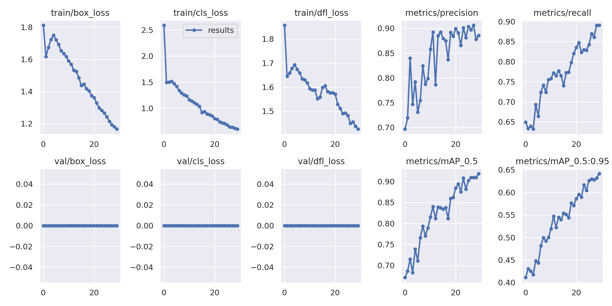
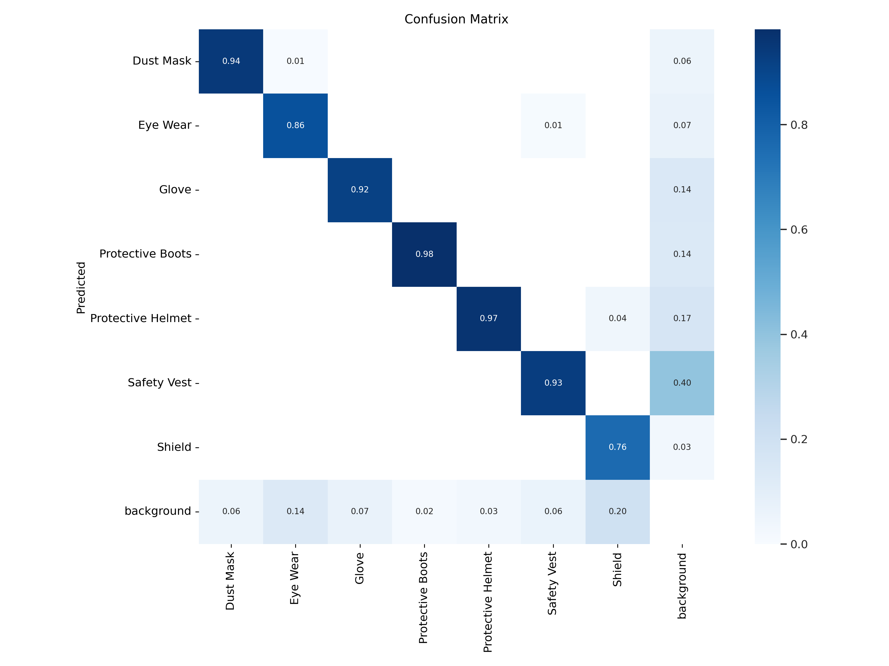

# 🦺 SafeVision: PPE Detection using YOLOv9


A powerful and real-time **PPE (Personal Protective Equipment) Detection System** using the state-of-the-art **YOLOv9** architecture. Designed to identify helmets, safety vests, gloves, and masks in live video feeds or images — ensuring safety compliance across industrial, construction, and healthcare environments.

---

## 🚀 Features

- ⚡ Real-time PPE detection using YOLOv9
- 🧠 Detects multiple PPE items (helmet, vest, gloves, masks, etc.)
- 📹 Supports both image and live webcam input
- 📦 Lightweight and optimized for deployment
- 🛠️ Easily customizable to add more PPE classes

---

## 📊 Metrics
[]
[]


## 🧠 Model Architecture

This project uses the latest YOLOv9 model for detection, trained on custom-labeled PPE datasets. YOLOv9 offers:

- Transformer-enhanced architecture
- Higher accuracy and speed than YOLOv5/v8
- Better object localization in cluttered environments

---

## 🛠️ Installation

```bash
git clone https://github.com/Samarth2190/SafeVision-YOLOv9.git
cd SafeVision-YOLOv9
pip install -r requirements.txt
```

PLease note this model was trained on Google colab 
---


## 📦 Requirements

- Python 3.8+
- PyTorch
- OpenCV
- numpy
- tqdm
- cvzone
- (and YOLOv9-specific dependencies)

Install via:

```bash
pip install -r requirements.txt
```

---

## ✨ Future Work

- Add alert system (email/SMS when no PPE is detected)
- Integrate with CCTV systems
- Deploy as a web or mobile app using Flask/Streamlit or React Native
- Edge deployment (Jetson Nano / Raspberry Pi)

---

## 🤝 Contributing

Pull requests are welcome! Feel free to open issues or submit new features, bug fixes, or improvements.

---

